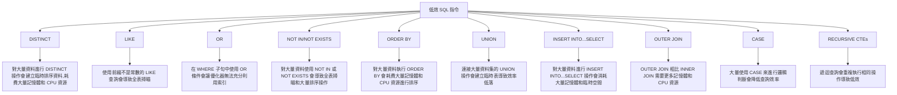

```mermaid
graph TD
    A[低效 SQL 指令] --> B1[DISTINCT]
    A --> B2[LIKE]
    A --> B3[OR]
    A --> B4[NOT IN/NOT EXISTS]
    A --> B5[ORDER BY]
    A --> B6[UNION]
    A --> B7[INSERT INTO...SELECT]
    A --> B8[OUTER JOIN]
    A --> B9[CASE]
    A --> B10[RECURSIVE CTEs]

    B1 --> C1[對大量資料進行 DISTINCT 操作會建立臨時排序資料,耗費大量記憶體和 CPU 資源]
    B2 --> C2[使用前綴不是常數的 LIKE 查詢會導致全表掃瞄]
    B3 --> C3[在 WHERE 子句中使用 OR 條件會讓優化器無法充分利用索引]
    B4 --> C4[對大量資料使用 NOT IN 或 NOT EXISTS 會導致全表掃瞄和大量排序操作]
    B5 --> C5[對大量資料執行 ORDER BY 會耗費大量記憶體和 CPU 資源進行排序]
    B6 --> C6[連接大量資料集的 UNION 操作會建立臨時表導致效率低落]
    B7 --> C7[對大量資料進行 INSERT INTO...SELECT 操作會消耗大量記憶體和臨時空間]
    B8 --> C8[OUTER JOIN 相比 INNER JOIN 需要更多記憶體和 CPU 資源]
    B9 --> C9[大量使用 CASE 來進行邏輯判斷會降低查詢效率]
    B10 --> C10[遞迴查詢會重複執行相同操作導致低效]
```