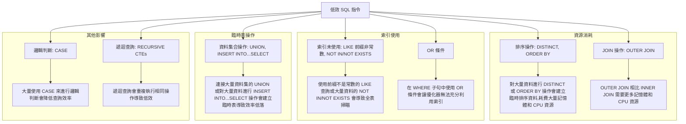
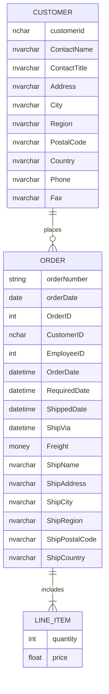
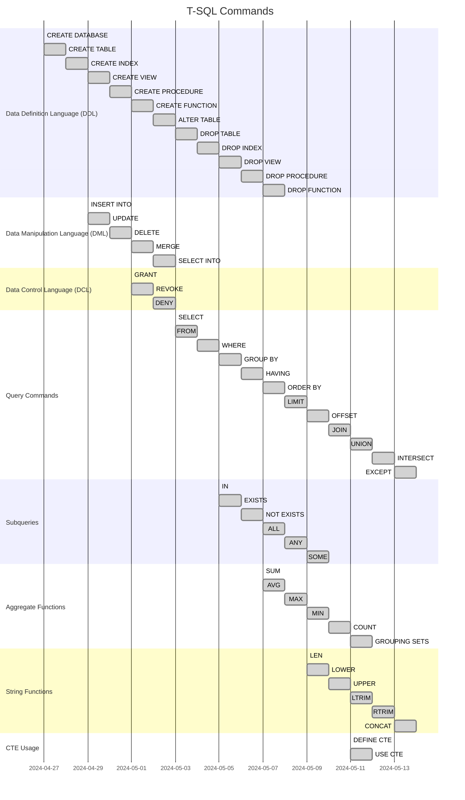

    --------------------------------------------------------------------------------------------------------------

# 50 SQL

## Entity-Relationship Diagram (ERD): An ERD is a structural diagram that illustrates the relationships between entities (tables) in a database. It helps in designing and understanding the database schema, identifying primary keys, foreign keys, and relationships between tables. ERDs are particularly useful during the database design phase and for documenting existing databases.
## Data Flow Diagram (DFD): A DFD is a graphical representation of the flow of data in a system, showing the processes, external entities, and the data flows between them. While not specific to SQL, DFDs can be helpful in understanding the overall data flow and how different components interact with the database.
## Database Schema Diagram: This diagram visually represents the structure of a database, including tables, columns, data types, primary keys, foreign keys, and relationships. It provides a clear overview of the database schema and can be useful for documentation and understanding the database design.
## Query Plan Diagram: A query plan diagram illustrates the execution plan chosen by the database management system (DBMS) to execute a specific SQL query. It can help in understanding how the DBMS processes a query, identifying potential performance bottlenecks, and optimizing queries.
## Database Architecture Diagram: This diagram depicts the overall architecture of a database system, including the various components such as client applications, connection pooling, load balancing, replication, and storage layers. It can be useful for understanding the high-level design and infrastructure of a database system.
## Database Cluster Diagram: For clustered or distributed database systems, a cluster diagram can represent the nodes, instances, and replication or sharding strategies employed in the database architecture.
## Database Backup and Recovery Diagram: This diagram illustrates the backup and recovery processes, including the different backup types (full, differential, transaction log), backup schedules, and restoration procedures. It can be helpful for documenting and understanding backup and disaster recovery strategies.

## In the CTE Usage section, I’ve added two tasks:

## DEFINE CTE: This represents the creation of the CTE using the WITH clause.
## USE CTE: This represents the usage of the defined CTE in a subsequent SQL operation.

## Certainly! A Common Table Expression (CTE) is a temporary result set that you can reference within a SELECT, INSERT, UPDATE, DELETE, or MERGE statement. It’s defined using the WITH clause and can make complex queries more readable and maintainable.

