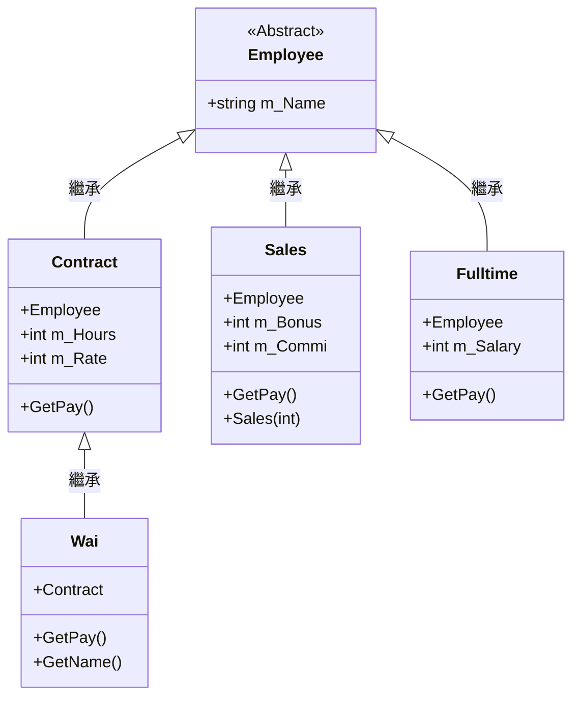

# OOP-practice1
# OOP
## Winform1
## 絕對值 客戶 
###  繼承 抽象 類別  建構函式 c#
### 介面  結構

#第二部分

```mermaid
classDiagram
  class Class 類別 {
    + Fields // 欄位
    + Constructors // 建構函式
    + Properties // 屬性
    + Methods // 方法
    + Events // 事件
  }

  class Interface 介面 {
    + Properties // 屬性
    + Methods // 方法
    + Events // 事件
  }

  Class 類別 <|-- Interface介面
  Class 類別 : supports inheritance // 支援繼承

  class Property 屬性 {
    + Accessors // 存取子
    + Logic and validation // 邏輯和驗證
  }

  class Delegate 委派{
    + Type-safe callable entity // 類型安全的可呼叫實體
    + Represents method signature // 表示方法簽名
    + Used for event-driven programming // 用於事件驅動程式設計
  }
  ```

```mermaid
gantt
    title T-SQL Commands

    section Data Definition Language (DDL)
    CREATE DATABASE :create1, 2023-08-01, 1d
    CREATE TABLE :create2, after create1, 1d
    CREATE INDEX :create3, after create2, 1d
    CREATE VIEW :create4, after create3, 1d
    CREATE PROCEDURE :create5, after create4, 1d
    CREATE FUNCTION :create6, after create5, 1d
    ALTER TABLE :alter1, after create6, 1d
    DROP TABLE :drop1, after alter1, 1d
    DROP INDEX :drop2, after drop1, 1d
    DROP VIEW :drop3, after drop2, 1d
    DROP PROCEDURE :drop4, after drop3, 1d
    DROP FUNCTION :drop5, after drop4, 1d

    section Data Manipulation Language (DML)
    INSERT INTO :insert1, 2023-08-15, 1d
    UPDATE :update1, after insert1, 1d
    DELETE :delete1, after update1, 1d
    MERGE :merge1, after delete1, 1d
    SELECT INTO :selectinto1, after merge1, 1d

    section Data Control Language (DCL)
    GRANT :grant1, 2023-08-21, 1d
    REVOKE :revoke1, after grant1, 1d
    DENY :deny1, after revoke1, 1d

    section Query Commands
    SELECT :select1, 2023-08-25, 1d
    FROM :from1, after select1, 1d
    WHERE :where1, after from1, 1d
    GROUP BY :groupby1, after where1, 1d
    HAVING :having1, after groupby1, 1d
    ORDER BY :orderby1, after having1, 1d
    LIMIT :limit1, after orderby1, 1d
    OFFSET :offset1, after limit1, 1d
    JOIN :join1, after offset1, 1d
    UNION :union1, after join1, 1d
    INTERSECT :intersect1, after union1, 1d
    EXCEPT :except1, after intersect1, 1d

    section Subqueries
    IN :in1, 2023-09-01, 1d
    EXISTS :exists1, after in1, 1d
    NOT EXISTS :notexists1, after exists1, 1d
    ALL :all1, after notexists1, 1d
    ANY :any1, after all1, 1d
    SOME :some1, after any1, 1d

    section Aggregate Functions
    SUM :sum1, 2023-09-05, 1d
    AVG :avg1, after sum1, 1d
    MAX :max1, after avg1, 1d
    MIN :min1, after max1, 1d
    COUNT :count1, after min1, 1d
    GROUPING SETS :groupingsets1, after count1, 1d

    section String Functions
    LEN :len1, 2023-09-10, 1d
    LOWER :lower1, after len1, 1d
    UPPER :upper1, after lower1, 1d
    LTRIM :ltrim1, after upper1, 1d
    RTRIM :rtrim1, after ltrim1, 1d
    CONCAT :concat1, after rtrim1, 1d
```
